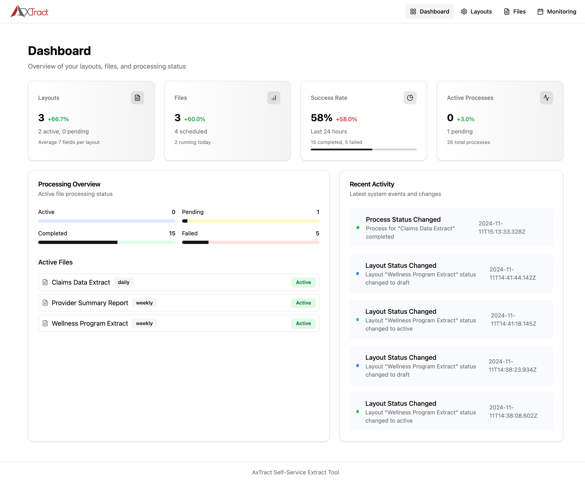
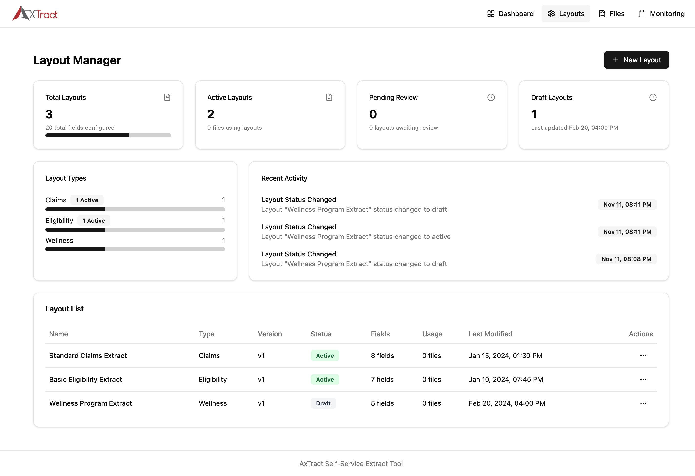
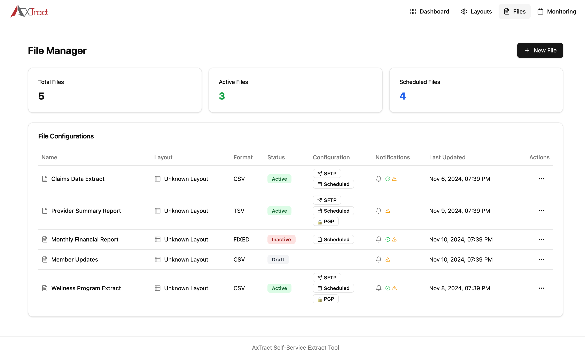
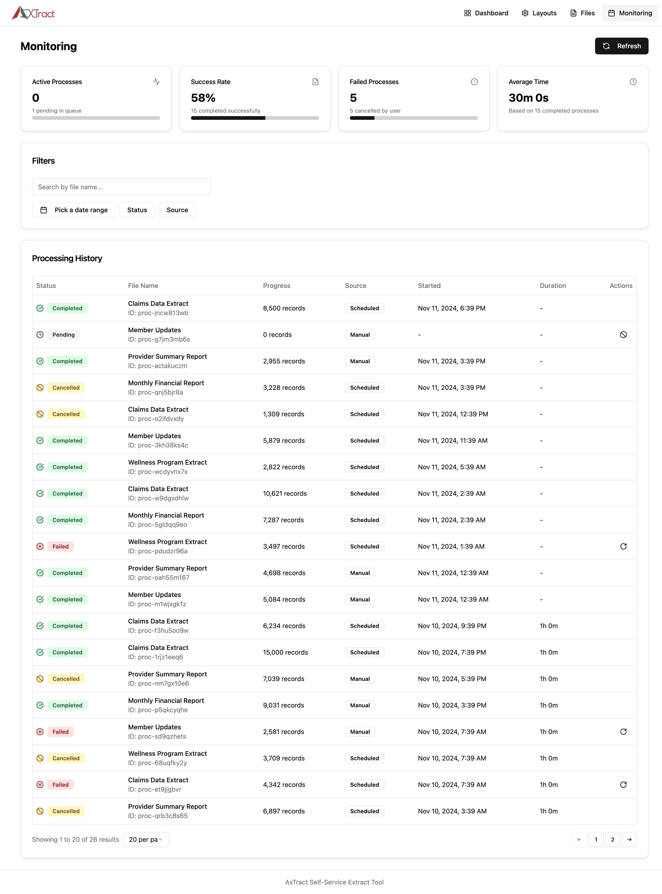
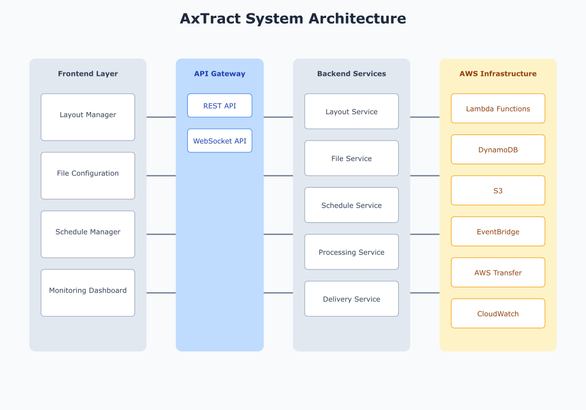
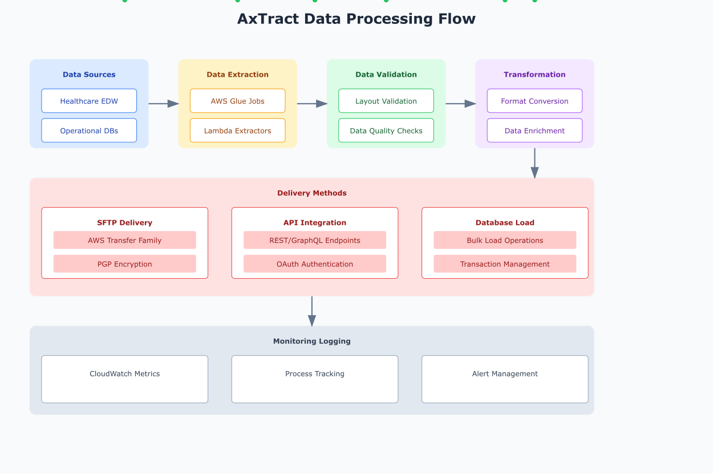

# AxTract - Self-Service Extract Tool

AxTract is a modern, web-based self-service extract tool that enables business users to configure, manage, and monitor data extracts for vendors and partners from a healthcare data platform. Built with React and TypeScript, it offers a streamlined interface for managing complex data extraction processes.



## Key Features

### Layout Manager
- Create and manage reusable data layouts
- Configure fields with validation rules and custom properties
- Support for multiple layout types (Claims, Eligibility, Wellness)
- Version control and draft management
- Field library with pre-configured templates



### File Configuration Manager
- Configure file outputs based on layouts
- Support for multiple file formats (CSV, TSV, Fixed Length)
- SFTP delivery configuration
- PGP encryption options
- Flexible scheduling options



### Scheduling and Automation
- Configure recurring schedules (Daily, Weekly, Monthly)
- Time window management
- Account-based scheduling
- Dependency management
- Automated file generation and delivery



### Monitoring Dashboard
- Real-time processing status
- 15-day forecast view
- Comprehensive error tracking
- Historical performance metrics
- Email notifications for success/failure


## Business Context

AxTract addresses common challenges in healthcare data management:

1. **Vendor Data Requirements**: Healthcare organizations need to share data with multiple vendors, each requiring specific formats and delivery methods.

2. **Compliance and Security**: Ensures secure data transmission with features like PGP encryption and SFTP delivery.

3. **Operation Efficiency**: Reduces manual effort in data extraction and delivery through automation and scheduling.

4. **Error Management**: Comprehensive monitoring and retry mechanisms ensure reliable data delivery.

## User Workflows

### Layout Management
1. Create/modify layout
2. Configure fields and validation
3. Export specifications
4. Get vendor approval
5. Activate layout

### File Configuration
1. Select approved layout
2. Configure format and delivery
3. Set up encryption
4. Configure notifications
5. Schedule generation

### Monitoring
1. Track file processing
2. Handle failures
3. View historical performance
4. Manage notifications

## Security Features

- Role-based access control
- Secure credential storage
- PGP encryption support
- SFTP with key authentication
- Audit trail logging

## Performance

- Supports files up to 50GB compressed
- Batch processing capabilities
- Configurable retry mechanisms
- Optimized for off-hours processing


## Development

### Prerequisites
```bash
node >= 18.0.0
npm >= 9.0.0
```

### Setup
```bash
git clone [repository]
cd axtract
npm install
npm run dev
```

### Build
```bash
npm run build
```

# AxTract System Architecture

## Overview
AxTract consists of two main components: a React-based frontend UI and a serverless AWS-based backend engine. The system enables business users to configure and manage data extracts through a modern web interface while leveraging cloud infrastructure for reliable data processing and delivery.





## System Components

### Frontend (UI Layer)
- **Technology Stack**: React, TypeScript, shadcn/ui
- **Key Features**:
  - Layout Manager
  - File Configuration
  - Schedule Management
  - Monitoring Dashboard
- **State Management**: Context API with reducers
- **API Integration**: REST API calls to backend services

### Backend (Processing Engine)
- **Core Services**:
  - Layout Management Service
  - File Processing Service
  - Schedule Management Service
  - Delivery Service
  - Monitoring Service
- **Infrastructure**: AWS Serverless Architecture
- **Security**: IAM roles, API Gateway authentication, encryption at rest and in transit

## API Integration Layer

### REST API Endpoints

1. Layout Management API:
```
POST   /api/layouts       # Create layout
GET    /api/layouts       # List layouts
GET    /api/layouts/{id}  # Get layout details
PUT    /api/layouts/{id}  # Update layout
DELETE /api/layouts/{id}  # Delete layout
```

2. File Configuration API:
```
POST   /api/files         # Create file configuration
GET    /api/files         # List files
GET    /api/files/{id}    # Get file details
PUT    /api/files/{id}    # Update file
DELETE /api/files/{id}    # Delete file
```

3. Schedule Management API:
```
POST   /api/schedules     # Create schedule
GET    /api/schedules     # List schedules
PUT    /api/schedules/{id}# Update schedule
DELETE /api/schedules/{id}# Delete schedule
```

4. Monitoring API:
```
GET    /api/processes     # List processes
GET    /api/processes/{id}# Get process details
POST   /api/processes/retry/{id} # Retry failed process
```

### WebSocket API
```
connect    /ws            # Connect to real-time updates
disconnect /ws            # Disconnect from updates
send       /ws/status    # Send status updates

