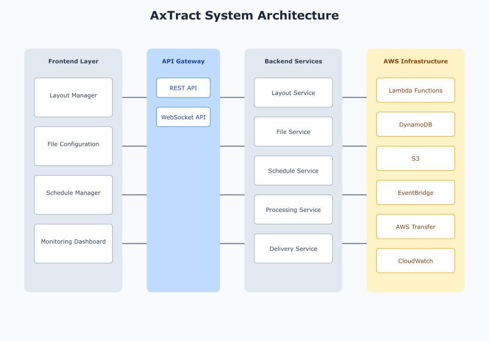

# AxTract Operations Manual

## System Architecture

### Infrastructure Overview


### Resource Requirements

#### Production Environment
```yaml
Web Servers:
  instance_type: t3.xlarge
  min_count: 4
  max_count: 12
  auto_scaling:
    cpu_threshold: 70%
    memory_threshold: 80%

Processing Servers:
  instance_type: c5.2xlarge
  min_count: 2
  max_count: 8
  auto_scaling:
    queue_depth_threshold: 1000
    processing_lag_threshold: 300s

Database:
  instance_type: db.r5.2xlarge
  storage: 2TB
  read_replicas: 2

Cache:
  instance_type: cache.r5.xlarge
  node_count: 2
  memory: 64GB

Queue:
  instance_type: kafka.m5.2xlarge
  brokers: 3
  retention: 7d
```

## Deployment Procedures

### Production Deployment

#### Pre-Deployment Checklist
```bash
# 1. Verify build artifacts
npm run verify
npm run test
npm run build

# 2. Check dependencies
npm audit
npm outdated

# 3. Update deployment manifest
version: "2.5.0"
timestamp: "2024-01-01T00:00:00Z"
commit_hash: "abc123"
build_number: "456"

# 4. Verify database migrations
npm run migrate:verify

# 5. Check certificate expiration
./scripts/check-certs.sh

# 6. Validate configuration
./scripts/validate-config.sh
```

#### Deployment Steps
```bash
# 1. Update load balancer rules
aws elbv2 modify-rule \
  --rule-arn $RULE_ARN \
  --actions Type=forward,TargetGroupArn=$NEW_TG_ARN

# 2. Deploy new version
kubectl apply -f k8s/production

# 3. Run database migrations
npm run migrate:up

# 4. Verify health checks
./scripts/health-check.sh

# 5. Update DNS
aws route53 change-resource-record-sets \
  --hosted-zone-id $ZONE_ID \
  --change-batch file://dns-update.json
```

#### Rollback Procedures
```bash
# 1. Revert to previous version
kubectl rollout undo deployment/axtract

# 2. Rollback database
npm run migrate:down

# 3. Restore DNS
aws route53 change-resource-record-sets \
  --hosted-zone-id $ZONE_ID \
  --change-batch file://dns-rollback.json

# 4. Notify stakeholders
./scripts/notify-rollback.sh
```

## Monitoring and Alerting

### Health Checks

#### Endpoint Monitoring
```typescript
interface HealthCheck {
  service: string;
  endpoint: string;
  method: 'GET' | 'POST';
  expectedStatus: number;
  timeout: number;
  interval: number;
  unhealthyThreshold: number;
  healthyThreshold: number;
}

const healthChecks: HealthCheck[] = [
  {
    service: 'api',
    endpoint: '/health',
    method: 'GET',
    expectedStatus: 200,
    timeout: 5,
    interval: 30,
    unhealthyThreshold: 3,
    healthyThreshold: 2
  },
  // ... other health checks
];
```

#### Performance Metrics
```typescript
interface PerformanceMetric {
  name: string;
  type: 'gauge' | 'counter' | 'histogram';
  threshold: number;
  criticalThreshold: number;
  aggregation: 'avg' | 'sum' | 'max';
  period: number;
}

const performanceMetrics: PerformanceMetric[] = [
  {
    name: 'api_latency',
    type: 'histogram',
    threshold: 500, // ms
    criticalThreshold: 1000, // ms
    aggregation: 'avg',
    period: 300 // 5 minutes
  },
  // ... other metrics
];
```

### Alert Configuration

#### Critical Alerts
```yaml
- name: API_HIGH_LATENCY
  condition: api_latency > 1000ms
  duration: 5m
  severity: critical
  notification:
    - type: pager
    - type: email
    - type: slack
  runbook: docs/runbooks/high-latency.md

- name: DATABASE_CONNECTION_ERRORS
  condition: db_connection_errors > 10
  duration: 5m
  severity: critical
  notification:
    - type: pager
    - type: email
  runbook: docs/runbooks/db-connection.md
```

#### Warning Alerts
```yaml
- name: HIGH_MEMORY_USAGE
  condition: memory_usage > 80%
  duration: 15m
  severity: warning
  notification:
    - type: email
    - type: slack
  runbook: docs/runbooks/memory-usage.md

- name: QUEUE_DEPTH_HIGH
  condition: kafka_queue_depth > 5000
  duration: 10m
  severity: warning
  notification:
    - type: email
    - type: slack
  runbook: docs/runbooks/queue-depth.md
```

## Backup and Recovery

### Backup Configuration

#### Database Backups
```yaml
full_backup:
  frequency: daily
  retention: 30d
  encryption: AES-256
  storage:
    type: S3
    bucket: axtract-backups
    prefix: db/full
    lifecycle:
      transition_glacier: 90d
      expire: 365d

incremental_backup:
  frequency: hourly
  retention: 7d
  encryption: AES-256
  storage:
    type: S3
    bucket: axtract-backups
    prefix: db/incremental
    lifecycle:
      expire: 30d
```

#### File Storage Backups
```yaml
configuration_backup:
  frequency: daily
  retention: 90d
  include:
    - layouts
    - file-configs
    - schedules
    - encryption-keys
  storage:
    type: S3
    bucket: axtract-backups
    prefix: config
    versioning: enabled

processed_files:
  retention: 30d
  storage:
    type: S3
    bucket: axtract-processed
    prefix: files
    lifecycle:
      transition_standard_ia: 30d
      transition_glacier: 90d
      expire: 365d
```

### Recovery Procedures

#### Database Recovery
```bash
#!/bin/bash

# 1. Stop application
kubectl scale deployment axtract --replicas=0

# 2. Identify backup to restore
aws s3 ls s3://axtract-backups/db/full/

# 3. Download backup
aws s3 cp s3://axtract-backups/db/full/backup.sql.gz .

# 4. Restore database
gunzip -c backup.sql.gz | psql -h $DB_HOST -U $DB_USER -d $DB_NAME

# 5. Apply incremental backups
for backup in $(aws s3 ls s3://axtract-backups/db/incremental/ | sort); do
  aws s3 cp s3://axtract-backups/db/incremental/$backup .
  psql -h $DB_HOST -U $DB_USER -d $DB_NAME -f $backup
done

# 6. Verify data integrity
npm run db:verify

# 7. Restart application
kubectl scale deployment axtract --replicas=4
```

#### Configuration Recovery
```bash
#!/bin/bash

# 1. Download configuration backup
aws s3 cp s3://axtract-backups/config/latest.zip .

# 2. Extract configuration
unzip latest.zip -d ./config

# 3. Verify configuration
./scripts/verify-config.sh

# 4. Apply configuration
kubectl apply -f ./config/k8s/

# 5. Verify application
./scripts/verify-app.sh
```

## Maintenance Procedures

### Routine Maintenance

#### Daily Tasks
```bash
# Database maintenance
./scripts/db-maintenance.sh
  --vacuum
  --analyze
  --reindex

# Log rotation
./scripts/rotate-logs.sh

# Backup verification
./scripts/verify-backups.sh

# Monitoring check
./scripts/check-monitoring.sh
```

#### Weekly Tasks
```bash
# Certificate check
./scripts/check-certs.sh

# Security updates
./scripts/security-updates.sh

# Performance analysis
./scripts/analyze-performance.sh

# Resource cleanup
./scripts/cleanup-resources.sh
```

#### Monthly Tasks
```bash
# Full system audit
./scripts/system-audit.sh

# Capacity planning
./scripts/capacity-planning.sh

# Compliance check
./scripts/compliance-check.sh

# DR testing
./scripts/dr-test.sh
```

### Performance Tuning

#### Database Optimization
```sql
-- Update statistics
ANALYZE VERBOSE;

-- Identify slow queries
SELECT 
  query,
  calls,
  total_time / 1000 as total_seconds,
  mean_time / 1000 as mean_seconds,
  rows
FROM pg_stat_statements
ORDER BY total_time DESC
LIMIT 10;

-- Add indexes
CREATE INDEX CONCURRENTLY idx_file_status 
ON files(status) 
WHERE status = 'active';
```

#### Cache Configuration
```typescript
interface CacheConfig {
  prefix: string;
  ttl: number;
  maxSize: number;
  strategy: 'LRU' | 'LFU';
}

const cacheConfigs: Record<string, CacheConfig> = {
  layouts: {
    prefix: 'layout:',
    ttl: 3600,
    maxSize: 1000,
    strategy: 'LRU'
  },
  fileConfigs: {
    prefix: 'file:',
    ttl: 1800,
    maxSize: 5000,
    strategy: 'LFU'
  }
};
```

## Troubleshooting Guide

### Common Issues

#### High API Latency
```typescript
async function diagnoseApiLatency() {
  // Check database connection pool
  const poolStats = await db.getPoolStats();
  if (poolStats.waiting > 10) {
    await increasePoolSize();
  }

  // Check cache hit rate
  const cacheStats = await cache.getStats();
  if (cacheStats.hitRate < 0.8) {
    await warmupCache();
  }

  // Check network latency
  const networkStats = await checkNetworkLatency();
  if (networkStats.latency > 100) {
    await notifyNetworkTeam();
  }
}
```

#### Failed Deliveries
```typescript
async function diagnoseDeliveryFailure(
  deliveryId: string
): Promise<DiagnosisResult> {
  const delivery = await getDeliveryDetails(deliveryId);
  
  switch (delivery.type) {
    case 'sftp':
      return await diagnoseSftpFailure(delivery);
    case 'api':
      return await diagnoseApiFailure(delivery);
    case 'database':
      return await diagnoseDatabaseFailure(delivery);
  }
}
```

### Recovery Procedures

#### Process Recovery
```typescript
async function recoverFailedProcess(processId: string) {
  // Get process details
  const process = await getProcessDetails(processId);
  
  // Clean up incomplete data
  await cleanupIncompleteData(process);
  
  // Reset process state
  await resetProcessState(process);
  
  // Retry process
  await retryProcess(process);
  
  // Verify recovery
  await verifyProcessRecovery(process);
}
```

#### Data Recovery
```typescript
async function recoverCorruptedData(
  fileId: string, 
  date: string
) {
  // Identify backup point
  const backup = await findNearestBackup(date);
  
  // Restore data
  await restoreFromBackup(backup, fileId);
  
  // Replay transactions
  await replayTransactions(fileId, date);
  
  // Verify data integrity
  await verifyDataIntegrity(fileId);
}
```

## Emergency Procedures

### System Outage

#### Initial Response
1. Identify affected systems
2. Notify stakeholders
3. Assess severity
4. Initiate incident response
5. Begin recovery procedures

#### Recovery Steps
```bash
# 1. Verify infrastructure
./scripts/verify-infrastructure.sh

# 2. Check database connectivity
./scripts/check-database.sh

# 3. Verify message queue
./scripts/verify-queue.sh

# 4. Check file storage
./scripts/check-storage.sh

# 5. Test delivery systems
./scripts/test-delivery.sh

# 6. Verify monitoring
./scripts/verify-monitoring.sh
```

### Data Corruption

#### Detection
```typescript
interface CorruptionCheck {
  type: 'checksum' | 'consistency' | 'validation';
  scope: 'file' | 'database' | 'cache';
  frequency: number;
  action: 'alert' | 'repair' | 'failover';
}

const corruptionChecks: CorruptionCheck[] = [
  {
    type: 'checksum',
    scope: 'file',
    frequency: 3600,
    action: 'alert'
  },
  // ... other checks
];
```

#### Recovery
```typescript
async function handleDataCorruption(
  corrupted: CorruptedData
): Promise<RecoveryResult> {
  // Isolate corrupted data
  await isolateCorruptedData(corrupted);
  
  // Identify corruption scope
  const scope = await identifyCorruptionScope(corrupted);
  
  // Restore from backup
  await restoreFromBackup(scope);
  
  // Verify restoration
  await verifyRestoration(scope);
  
  // Resume operations
  await resumeOperations(scope);
  
  return getRecoveryResults(scope);
}
```

## Appendix

### Reference Architecture


For additional details or specific implementation guides, please refer to the following documentation:
- [Technical Documentation](./technical-docs.md)
- [API Documentation](./api-docs.md)
- [Development Guide](./development-guide.md)
- [Security Policies](./security-policies.md)
- [Operations Manual](./operations-manual.md)
