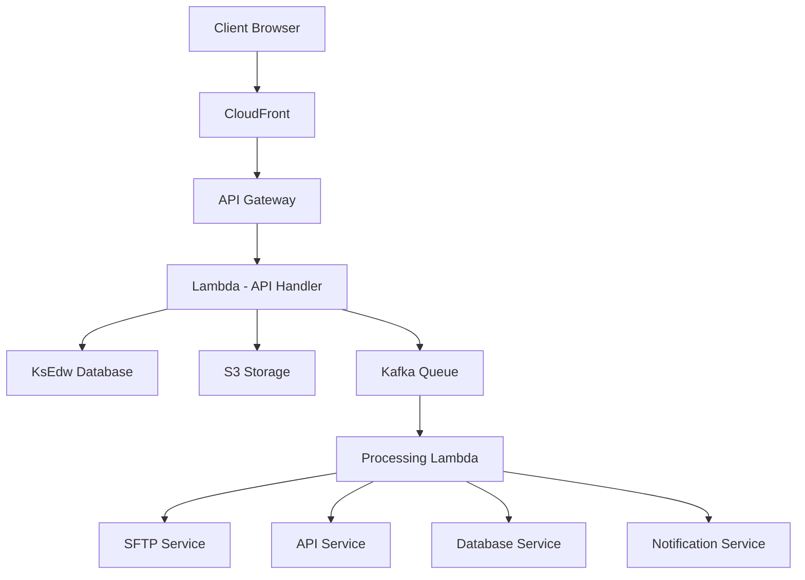

# AxTract Technical Documentation

## System Architecture

### Overview
AxTract consists of two main components: a React-based frontend UI and a serverless AWS-based backend engine. The system enables business users to configure and manage data extracts through a modern web interface while leveraging cloud infrastructure for reliable data processing and delivery.

### System Components

#### Frontend (UI Layer)
- **Technology Stack**: 
  - React 18+
  - TypeScript 5.0+
  - shadcn/ui components
  - Tailwind CSS
  - React Router v6
  - Context API for state management
- **Key Features**:
  - Layout Manager
  - File Configuration
  - Schedule Management
  - Monitoring Dashboard
- **State Management**: 
  - Context API with reducers
  - Optimistic updates
  - Real-time WebSocket updates
- **API Integration**: 
  - REST API calls to backend services
  - WebSocket connections for real-time updates
  - Retry mechanisms for failed API calls

#### Backend (Processing Engine)

##### Core Services
1. **Layout Management Service**
   - Layout validation
   - Version control
   - Field configuration
   - Template management

2. **File Processing Service**
   - Format conversion
   - Data extraction
   - Transformation rules
   - Validation checks

3. **Schedule Management Service**
   - Job scheduling
   - Dependency management
   - Time window handling
   - Retry coordination

4. **Delivery Service**
   - SFTP transfer handling
   - API request management
   - Database connection pooling
   - Retry logic implementation

5. **Monitoring Service**
   - Process tracking
   - Status updates
   - Error logging
   - Performance metrics

##### Infrastructure Components
- **Database**: Primary EDW
  - Read-only access to source data
  - Optimized query patterns
  - Connection pooling

- **Scheduler**: Jenkins
  - Job orchestration
  - Dependency management
  - Failure handling
  - Resource management

- **Message Queue**: Kafka
  - Event streaming
  - Process coordination
  - Real-time updates
  - Error queues

- **Storage**: AWS S3
  - Temporary file storage
  - Archive management
  - Version control
  - Lifecycle policies

- **Secure Vault**: 
  - Credential management
  - Key storage
  - Secret rotation
  - Access control

## API Integration Layer

### REST API Endpoints

#### Layout Management API
```
POST   /api/layouts
GET    /api/layouts
GET    /api/layouts/{id}
PUT    /api/layouts/{id}
DELETE /api/layouts/{id}
PATCH  /api/layouts/{id}/status
GET    /api/layouts/{id}/fields
POST   /api/layouts/{id}/validate
GET    /api/layouts/{id}/export
```

#### File Configuration API
```
POST   /api/files
GET    /api/files
GET    /api/files/{id}
PUT    /api/files/{id}
DELETE /api/files/{id}
PATCH  /api/files/{id}/status
POST   /api/files/{id}/test
GET    /api/files/{id}/history
```

#### Schedule Management API
```
POST   /api/schedules
GET    /api/schedules
PUT    /api/schedules/{id}
DELETE /api/schedules/{id}
PATCH  /api/schedules/{id}/status
GET    /api/schedules/forecast
POST   /api/schedules/{id}/execute
```

#### Monitoring API
```
GET    /api/processes
GET    /api/processes/{id}
POST   /api/processes/retry/{id}
GET    /api/processes/metrics
GET    /api/processes/status
POST   /api/processes/{id}/cancel
```

#### Delivery Management API
```
# SFTP Management
POST   /api/delivery/sftp/validate
POST   /api/delivery/sftp/test
GET    /api/delivery/sftp/status/{id}

# API Management
POST   /api/delivery/api/validate
POST   /api/delivery/api/test
GET    /api/delivery/api/status/{id}

# Database Management
POST   /api/delivery/db/validate
POST   /api/delivery/db/test
GET    /api/delivery/db/status/{id}
```

### WebSocket API
```
connect    /ws
disconnect /ws
subscribe  /ws/processes/{id}
subscribe  /ws/files/{id}
subscribe  /ws/delivery/{id}
```

### API Authentication
- JWT-based authentication
- API key support for service accounts
- Role-based access control
- Rate limiting
- Request signing for sensitive operations

### Error Handling
```json
{
  "error": {
    "code": "ERROR_CODE",
    "message": "Human readable message",
    "details": {
      "field": "Additional error context"
    },
    "requestId": "unique-request-id",
    "timestamp": "2024-01-01T00:00:00Z"
  }
}
```

## Data Models

### Layout Model
```typescript
interface Layout {
  id: string;
  name: string;
  type: 'claims' | 'eligibility' | 'wellness';
  status: 'draft' | 'active' | 'inactive';
  version: number;
  fields: Field[];
  metadata: Record<string, any>;
  createdAt: string;
  updatedAt: string;
}
```

### File Configuration Model
```typescript
interface FileConfiguration {
  id: string;
  name: string;
  layoutId: string;
  format: 'CSV' | 'TSV' | 'JSON' | 'FIXED';
  status: 'draft' | 'active' | 'inactive';
  deliveryConfig: DeliveryConfiguration;
  scheduleConfig?: ScheduleConfiguration;
  encryptionConfig?: EncryptionConfiguration;
  notificationConfig?: NotificationConfiguration;
  createdAt: string;
  updatedAt: string;
}
```

### Delivery Configuration Models

#### SFTP Configuration
```typescript
interface SFTPConfiguration {
  type: 'sftp';
  host: string;
  port: number;
  username: string;
  path: string;
  knownHostKey?: string;
}
```

#### API Configuration
```typescript
interface APIConfiguration {
  type: 'api';
  method: 'POST' | 'PUT' | 'PATCH';
  url: string;
  headers?: Record<string, string>;
  validateSsl: boolean;
  timeout?: number;
  retryStrategy?: {
    maxRetries: number;
    backoffMultiplier: number;
  };
}
```

#### Database Configuration
```typescript
interface DatabaseConfiguration {
  type: 'database';
  dbType: 'postgresql' | 'mysql' | 'sqlserver' | 'oracle';
  host: string;
  port: number;
  name: string;
  username: string;
  schema: string;
  table: string;
  writeMode: 'insert' | 'upsert' | 'replace';
  batchSize?: number;
  connectionTimeout?: number;
}
```

## Security Considerations

### Authentication & Authorization
- JWT-based user authentication
- Role-based access control (RBAC)
- Service account management
- API key rotation policies
- Session management

### Data Security
- End-to-end encryption
- PGP encryption for sensitive data
- TLS 1.3 for all communications
- Data masking capabilities
- Audit logging

### Infrastructure Security
- AWS security groups
- Network ACLs
- VPC configuration
- IAM roles and policies
- Key management

### Compliance
- HIPAA compliance measures
- Audit trail maintenance
- Data retention policies
- Access logging
- Security scanning

## Performance Optimizations

### Database
- Connection pooling
- Query optimization
- Indexing strategy
- Partitioning scheme

### File Processing
- Batch processing
- Streaming for large files
- Compression
- Parallel processing

### API Performance
- Request batching
- Response caching
- Rate limiting
- Circuit breaking

### Monitoring
- Performance metrics
- Resource utilization
- Error tracking
- SLA monitoring

## Deployment Architecture



## Development Guidelines

### Code Standards
- TypeScript strict mode
- ESLint configuration
- Prettier formatting
- Git commit conventions
- Documentation requirements

### Testing Requirements
- Unit test coverage (>80%)
- Integration testing
- E2E testing
- Performance testing
- Security scanning

### CI/CD Pipeline
- Build process
- Test automation
- Deployment stages
- Rollback procedures
- Environment management

### Monitoring Setup
- CloudWatch metrics
- Error tracking
- Performance monitoring
- Cost monitoring
- Security monitoring

For additional details or specific implementation guides, please refer to the following documentation:
- [Technical Documentation](./technical-docs.md)
- [API Documentation](./api-docs.md)
- [Development Guide](./development-guide.md)
- [Security Policies](./security-policies.md)
- [Operations Manual](./operations-manual.md)